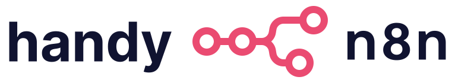

  
  <h1>💻 handy-n8n 🤖</h1>

## 项目介绍

在自动化工作流日益重要的当下，n8n 凭借其强大的集成能力和灵活的配置方式，成为众多开发者和企业的
首选工具。本课程以 “理论 + 实操” 为核心，通过系统的内容编排，带你从入门到精通 n8n，解锁自动化
工作流的无限可能。

1. 多维度对比与深度解析：开篇将 n8n 与 dify 等工具进行全面对比，帮助你快速掌握 n8n 的独特优
   势，明确其适用场景，为后续学习奠定基础。
2. 全场景部署教学：覆盖多种部署模式，无论你处于何种技术环境，都能轻松完成 n8n 部署，开启 n8n 之旅
3. 系统化知识体系：从界面操作、节点功能（Trigger、控制流、数据处理等十余类节点）到代码处理
   （变量、表达式、第三方库）、鉴权机制，循序渐进构建完整知识框架，助你快速上手 n8n 核心功能。
4. 前沿高阶应用：深入探索 RAG、向量存储、Chat 模式、MCP 等前沿技术，结合 Human in the loop
   与异常处理实践，带你突破常规，掌握 n8n 在复杂场景下的高级玩法。
5. 自定义开发与实战：手把手教学开发自定义节点，满足个性化需求；通过丰富的案例分析与实践课题，
   将所学知识转化为实际生产力，真正做到学以致用。

## 适合人群 

- 希望提升工作效率，实现业务流程自动化的职场人士 
- 对自动化工作流、低代码开发感兴趣的开发者 
- 计划使用 n8n 搭建复杂集成系统的技术团队成员

### 前置要求

n8n 虽主打低代码、无代码的工作流编排，但若想更好地理解和运用它，我们建议你具备以下基础：

- 提问与解决问题的能力，以及动手能力： 善于发现问题、提出疑问并亲自动手尝试解决，是高效使用任何工具的关键。
- 科学的网络环境
- 基本的编程知识： 理解条件、循环、函数等编程概念，能让你更好地理解 n8n 的逻辑构建。
- 了解 HTTP 请求、JSON 数据格式、Webhook： 这些是现代网络应用中数据交互的核心，掌握它们能让你轻松集成各种服务。
- 了解 AI、Agent、RAG 等概念： 如果你计划使用 n8n 来构建与人工智能相关的流程，对这些概念的理解会非常有帮助。
- 英语阅读能力： 由于 n8n 暂时没有官方支持的中文版本，查阅官方文档和社区资源时，良好的英语阅读能力必不可少。
- 命令行、容器化知识（针对私有部署）： 如果你希望将 n8n 部署到自己的服务器，了解命令行操作和容器化技术（如 Docker）会大有裨益。
- 编程语言阅读能力： 能够读懂 JavaScript、Python 等常见编程语言的代码，将有助于你理解代码节点相关的内容。
- JavaScript、TypeScript 编程知识（针对高阶课程内容）： 如果你希望参与高阶课程，进行自定义节点开发，那么掌握 JavaScript 和 TypeScript 是必备技能。

当然，相关的要求，如英语、代码解释等，可以通过翻译工具或者大语言模型，辅助理解。

## 课程大纲

## 贡献者名单

| 姓名   | 职责       | 简介                                                          |
| :----- | :--------- | :------------------------------------------------------------ |
| 王晓亮 | 项目负责人 | [@tomowang](https://github.com/tomowang) 🌐<https://tomo.dev> |

## 参与贡献

- 如果你发现了一些问题，可以提 Issue 进行反馈，如果提完没有人回复你可以联系[保姆团队](https://github.com/datawhalechina/DOPMC/blob/main/OP.md)的同学进行反馈跟进~
- 如果你想参与贡献本项目，可以提 Pull request，如果提完没有人回复你可以联系[保姆团队](https://github.com/datawhalechina/DOPMC/blob/main/OP.md)的同学进行反馈跟进~
- 如果你对 Datawhale 很感兴趣并想要发起一个新的项目，请按照[Datawhale 开源项目指南](https://github.com/datawhalechina/DOPMC/blob/main/GUIDE.md)进行操作即可~

## 关注我们

扫描下方二维码关注公众号：Datawhale

## LICENSE

 本作品采用<a rel="license" href="http://creativecommons.org/licenses/by-nc-sa/4.0/">知识共享署名-非商业性使用-相同方式共享 4.0 国际许可协议</a>进行许可。
