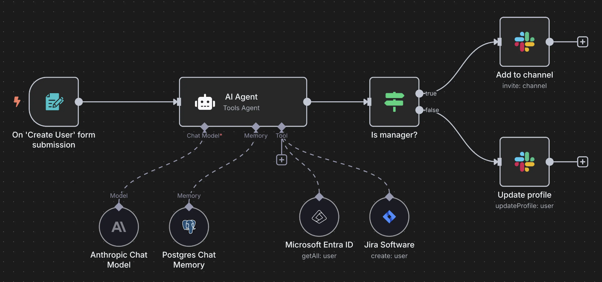

# Capter01 n8n 初识

## n8n 简介

n8n 意思是 nodemation，是 node 与 automation 的组合词，读作 n-eight-n。
n8n 是一个开源的、基于节点的自动化工具，官方站点为<https://n8n.io/>，官方 GitHub 仓库为
<https://github.com/n8n-io/n8n>，目前有 star 数如下

n8n 的主要特点包括：

- 模块化： 将复杂任务分解为可管理的小块，每个块代表一个操作或一个服务连接。
- 可视化： 通过直观的拖放界面构建工作流程，让流程一目了然。
- 可扩展性： 支持数百种集成，并允许用户创建自定义节点，满足特定需求。
- 数据流： 数据在节点之间流动，每个节点对数据进行处理或转换，直至完成整个工作流程。

n8n 的应用场景非常广泛，几乎可以自动化任何涉及多个应用程序和数据流的任务。以下是一些常见的应用示例：

- 数据同步与迁移：

  - 将 CRM 系统中的新客户数据自动同步到邮件营销工具。
  - 从第三方 API 获取数据并存储到数据库中。
  - 定期备份重要数据到云存储服务。

- 营销自动化：

  - 当有新的潜在客户提交表单时，自动发送欢迎邮件并创建 CRM 记录。
  - 根据用户行为自动发送个性化营销信息。
  - 监控社交媒体提及，并自动发送通知或回复。

- 客户服务与支持：

  - 当收到新的支持票据时，自动通知相关团队并创建内部任务。
  - 将客户反馈自动汇总到报告中。
  - 根据客户问题的关键词自动路由到正确的支持团队。

- 内部流程自动化：

  - 当员工提交休假申请时，自动触发审批流程并更新日历。
  - 自动化报告生成和分发。
  - 管理项目任务和通知。

- 内容管理：

  - 从 RSS 订阅获取最新文章并自动发布到社交媒体。
  - 监控指定网站的内容更新，并自动通知。
  - 将不同平台的内容自动聚合到一处。

- 开发与运维辅助：

  - 当代码部署成功时，自动发送通知给团队。
  - 监控服务器状态并在异常时自动触发警报。
  - 自动化 API 测试和数据验证。

如下是官网提供的新员工入职的工作流示例图：

同时，n8n 官方提供了很多原生的节点，可以满足大部分的自动化需求，

官方给相关的节点进行了分类，主要的几个类别如下：

- AI - 涵盖 Agent、LLM、向量数据库、记忆体等集成，是 n8n 核心优势之一
- Communication - 各种通讯工具，如邮件、Slack 等，用于消息通知或回调
- Data & Storage - 数据与存储，包括 Google Sheets、关系型数据库、NoSQL、对象存储等
- Development - 代码块、Webhook、HTTP、GitHub 等
- HITL - Human-in-the-loop，用于与人类交互的节点，主要为通讯类节点

可以通过<https://n8n.io/integrations/>查看所有支持的节点。

另外，n8n 社区也提供了很多第三方开发的节点，可以满足更复杂的自动化需求。如果三方社区节点也不满足
业务需求，n8n 还提供了自定义节点的功能，可以开发自己的节点。

## n8n 与其他工具的对比

| 对比维度         | n8n                                                                               | dify                                                                                                 | coze                                                                                  |
| ---------------- | --------------------------------------------------------------------------------- | ---------------------------------------------------------------------------------------------------- | ------------------------------------------------------------------------------------- |
| **功能特性**     | 支持广泛的自动化任务，拥有丰富节点类型，可处理复杂工作流；AI 功能主要依赖节点集成 | 专注于 AI 驱动的自动化，支持 RAG、多模态交互等先进 AI 功能，适合构建智能应用；传统自动化任务支持有限 | 主打低代码 AI 应用开发，内置多种 AI 组件，AI 交互设计灵活；自动化流程处理能力相对基础 |
| **易用性**       | 界面直观，但节点配置和复杂工作流搭建需一定学习成本                                | 操作相对简洁，AI 相关功能设置较便捷；对非技术用户，AI 技术概念理解有难度                             | 低代码操作模式，可视化设计友好，学习门槛低；复杂功能需深入探索                        |
| **扩展性**       | 支持自定义节点开发，可与众多第三方应用集成，扩展性强                              | 支持插件扩展，能与多种 AI 模型和数据源对接；但非 AI 相关扩展能力不足                                 | 支持自定义组件，可接入多种 AI 服务；整体生态和扩展性处于发展阶段                      |
| **部署方式**     | 支持本地部署（Docker 等）、云端部署，部署灵活性高，数据可控性强                   | 以云端服务为主，提供便捷的在线开发环境；本地部署支持有限，数据存在一定云平台依赖                     | 主要通过云端使用，无开源版本，适合快速搭建线上应用                                    |
| **性能与稳定性** | 性能稳定，可处理大量数据和复杂工作流，但大规模并发下需优化配置                    | 在 AI 任务处理上性能较好，依赖云端资源；网络波动时可能影响使用                                       | 性能表现良好，适合中小型 AI 应用；高负载场景下表现有待验证                            |
| **社区与支持**   | 社区活跃，官方文档详细，开源项目多，技术支持资源丰富                              | 社区处于发展中，官方文档较新但部分内容待完善，商业化支持较好                                         | 社区逐渐壮大，官方提供教程和案例，低代码用户支持度高                                  |
| **成本**         | 开源免费，企业版提供高级功能需付费；适合有定制需求的用户                          | 基础功能免费，高级 AI 功能和服务需付费，按使用量或功能模块收费                                       | 部分功能免费，高级功能和团队协作需付费，定价适合中小团队                              |

总结来说，coze 主打低代码 AI 应用开发，其内置多种 AI 组件且 AI 交互设计灵活，学习门槛低，
适合中小团队快速搭建线上的中小型 AI 应用。dify 专注于 AI 驱动的自动化，内置知识库，支持 RAG，
在 AI 任务处理上性能较好，适合构建智能应用。n8n 支持海外主流平台的对接，其灵活的编排方式适用于
处理复杂自动化工作流、对部署灵活性和功能定制化有高要求的个人及企业用户。
