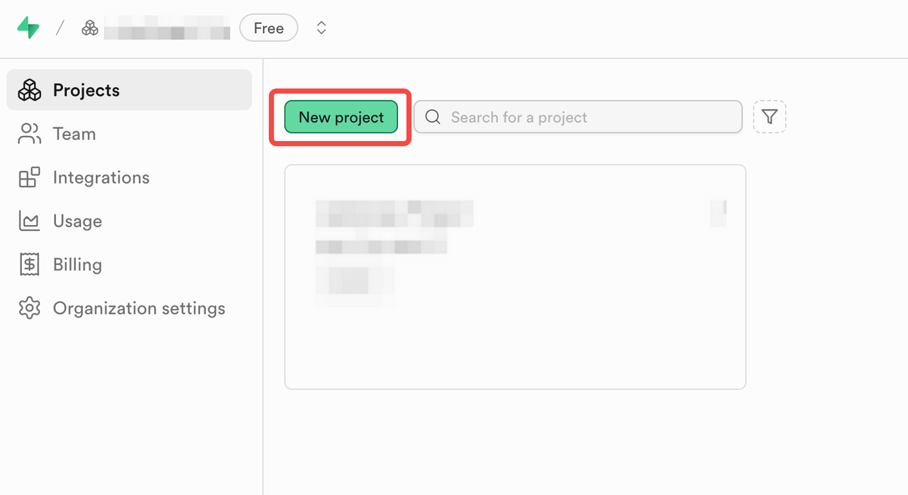
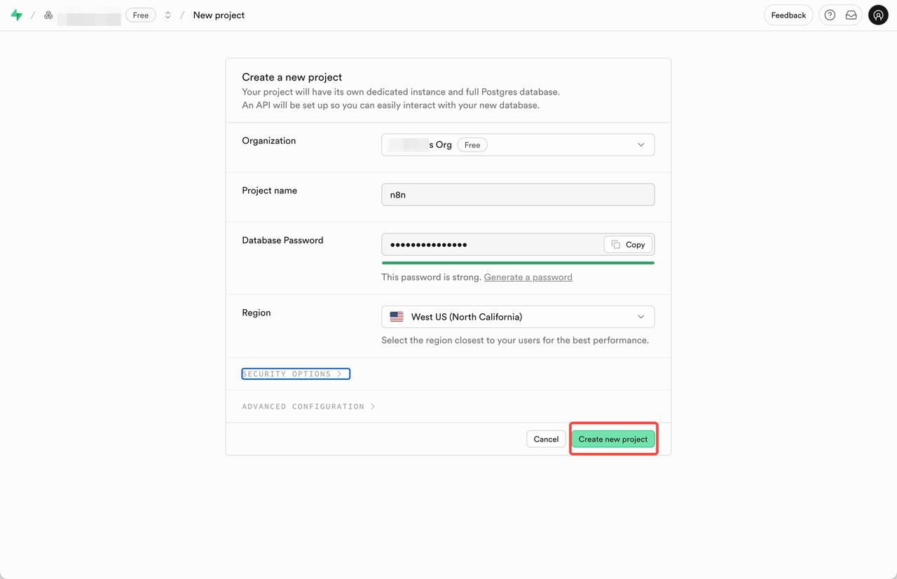
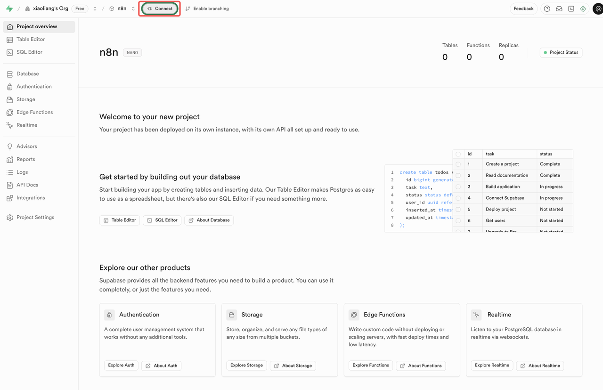
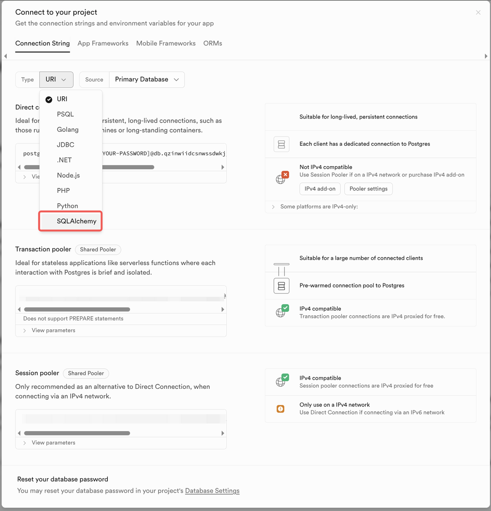
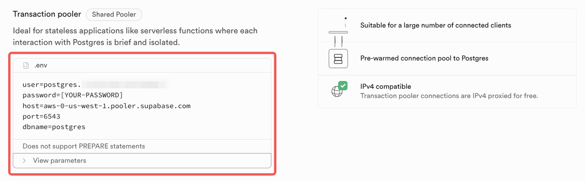
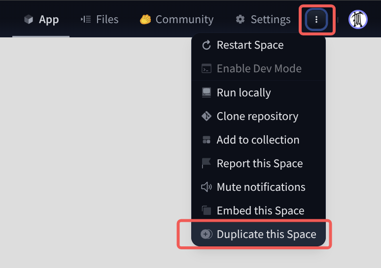
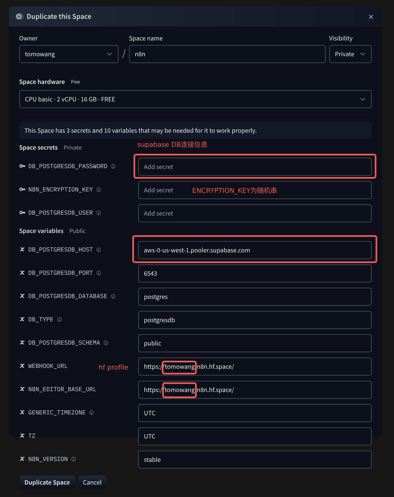
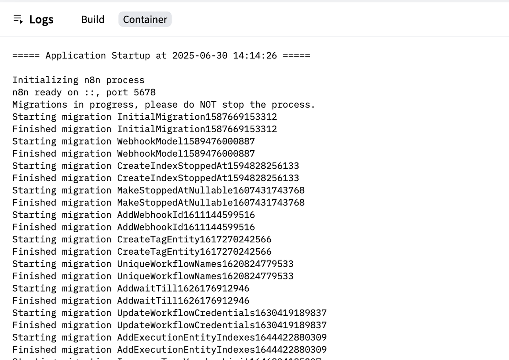
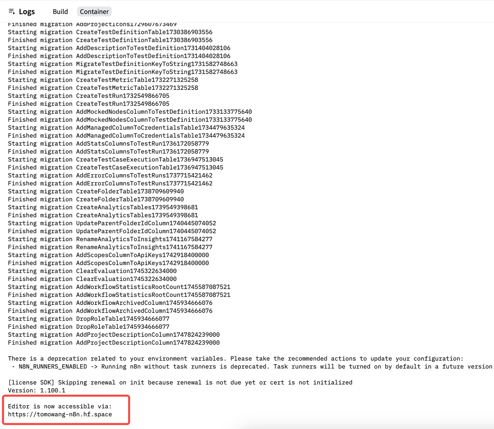

# huggingface space 部署

云服务部署需要主机，且需要域名，有一定的门槛，最后我们介绍使用 huggingface space 部署 n8n。
huggingface space 是 huggingface 提供的一个在线服务环境，其支持 docker 部署应用。

## 通过 supabase 创建数据库

由于 huggingface space 在长时间未使用后，会“进入休眠”状态并停止执行。我们需要使用外部数据库
来保存 n8n 服务的数据，这里我们使用 supabase 提供的服务。

1. 注册 supabase 账号，[https://supabase.com/dashboard/sign-up](https://supabase.com/dashboard/sign-up)
2. 创建项目，按表单填写项目相关配置。**保存填写的数据库密码，后面会使用到**

   
   

3. 查看数据库链接信息，点击 Project 左上角的`Connect`按钮

   

4. Connection String 中，选择`SQLAlchemy`，找到`Transaction pooler`

   
   

5. 记录下提供的数据库连接信息，如 host、port、user、password、dbname 等。

## 使用 huggingface space 部署 n8n

huggingface space 免费版本提供的服务资源，足够 n8n 服务的运行。

| **Hardware** | **GPU Memory** | **CPU** | **Memory** | **Disk** | **Hourly Price** |
| ------------ | -------------- | ------- | ---------- | -------- | ---------------- |
| CPU Basic    | -              | 2 vCPU  | 16 GB      | 50 GB    | Free!            |

课程作者创建了 n8n 空间模板项目，可共学习者直接使用。

1. 首先需要注册 huggingface 账号，记住自己的 profile 名字。如<https://huggingface.co/tomowang>
   中的`tomowang`即为 profile 名字
2. 访问[https://huggingface.co/spaces/tomowang/n8n](https://huggingface.co/spaces/tomowang/n8n)，
   在右上角点击垂直省略按钮，选择**Duplicate this space**

   

3. 在弹出的对话框中，配置相关的环境变量

   

   | **Variable**             | **Value**                                     |
   | ------------------------ | --------------------------------------------- |
   | `DB_POSTGRESDB_PASSWORD` | 为 supabase 项目创建时配置的数据库密码        |
   | `DB_POSTGRESDB_USER`     | 为之前链接信息中的`user`                      |
   | `DB_POSTGRESDB_HOST`     | 为之前链接信息中的`host`                      |
   | `DB_POSTGRESDB_PORT`     | 6543                                          |
   | `N8N_ENCRYPTION_KEY`     | 随机串，可以使用`openssl rand -base64 32`生成 |
   | `WEBHOOK_URL`            | 格式为 `https://<profile>-n8n.hf.space/`      |
   | `N8N_EDITOR_BASE_URL`    | 格式为 `https://<profile>-n8n.hf.space/`      |
   | `GENERIC_TIMEZONE`       | 按需填写，如 Asia/Shanghai                    |
   | `TZ`                     | 按需填写，如 Asia/Shanghai                    |

4. 点击**Duplicate Space**按钮，等待部署完成，相关日志输出如下

   

5. 最终部署完成后会输出如下日志，展示我们配置的`N8N_EDITOR_BASE_URL`地址，访问该地址即可
   开始使用 n8n

   

需要注意的是，n8n 使用[helmet](https://github.com/helmetjs/helmet)来处理 HTTP 相关的安全
配置，在生产环境中会默认配置`X-Frame-Options` 为 `sameorigin`，以禁止 iframe 嵌入。所以
后续可以直接打开上图中展示的地址直接使用。

最后附上原始的 Dockerfile 供参考<https://huggingface.co/spaces/tomowang/n8n/blob/main/Dockerfile>

```Dockerfile
ARG N8N_VERSION=stable

FROM docker.n8n.io/n8nio/n8n:$N8N_VERSION

LABEL maintainer="Xiaoliang <xiaoliang.zero@gmail.com>"

ENV N8N_ENFORCE_SETTINGS_FILE_PERMISSIONS=true \
    N8N_RUNNERS_ENABLED=true \
    N8N_PROXY_HOPS=1

# https://huggingface.co/docs/hub/spaces-sdks-docker#permissions
# The container runs with user ID 1000.
# node docker image already has a user named node with ID 1000.
USER node

VOLUME ["$HOME/.n8n"]

# n8n default port
EXPOSE 5678

ENTRYPOINT ["tini", "--", "/docker-entrypoint.sh"]
```
