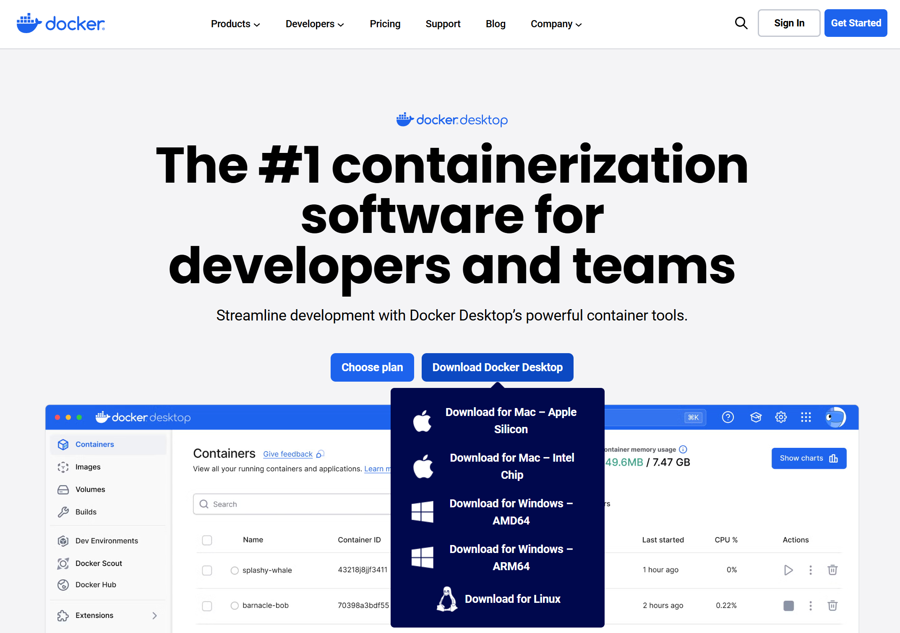
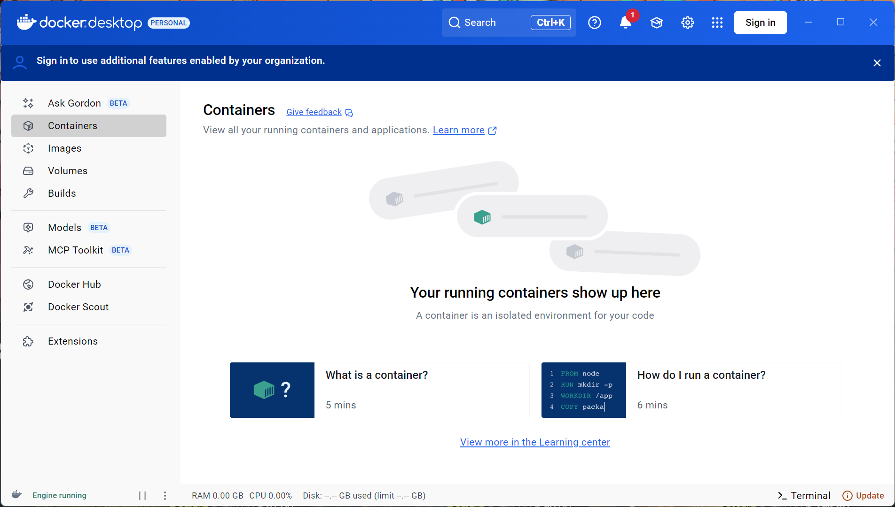
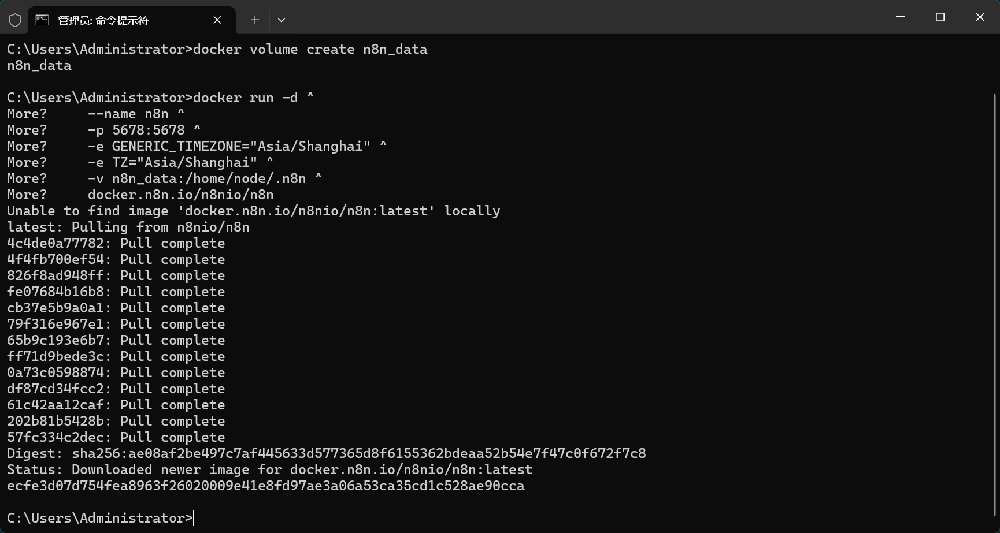
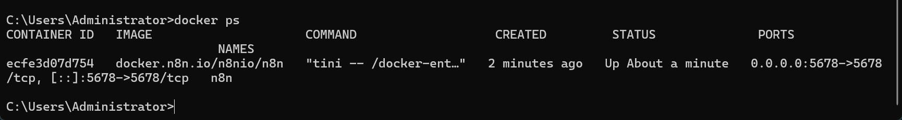
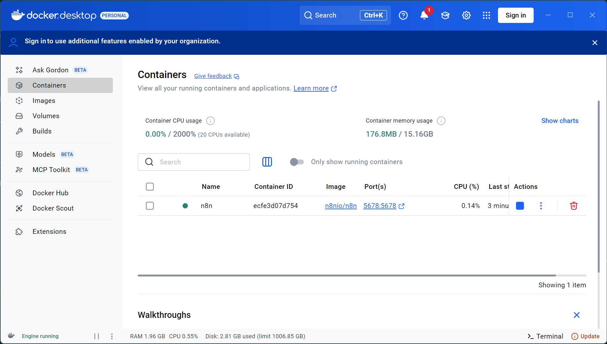
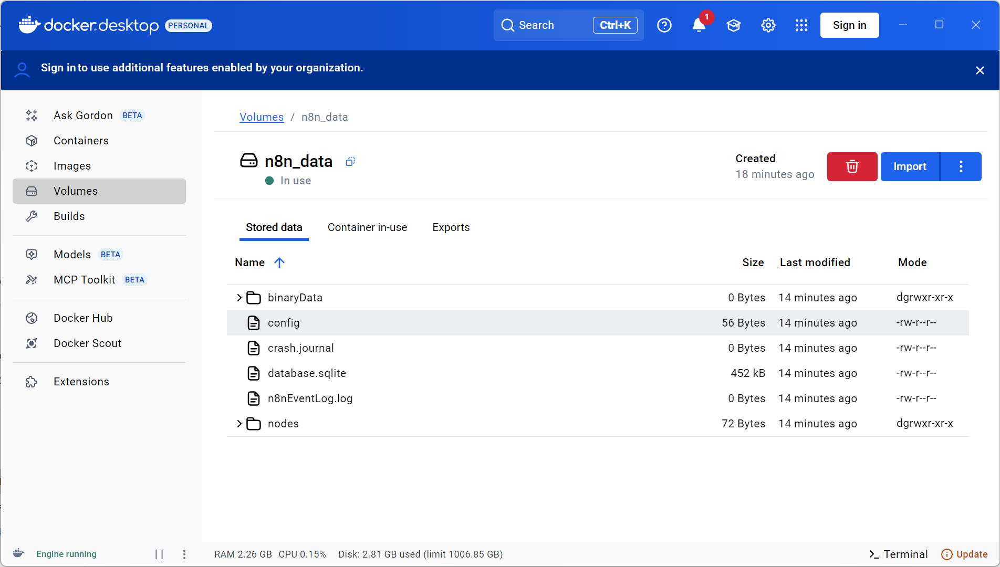

# 本地 PC 部署

本地部署推荐使用 docker 的部署方式。使用 docker 可以避免由于不同操作系统造成的问题，
因为 Docker 提供了一个一致的系统，可以避免由于操作系统和工具之间的差异造成的兼容性问题。

官方提供了基于 docker 环境的安装指南，可以参考<https://docs.n8n.io/hosting/installation/docker/>。

## 安装 docker 环境

> 以下使用 Windows 系统作为示例，如果本地已经有 docker 环境可以跳过该步骤。

从官网<https://www.docker.com/products/docker-desktop/>下载 docker desktop 安装包。



双击 docker 安装包完成安装，随后启动 docker，当看到如下界面时表示安装成功



## 运行 n8n

打开命令提示符软件（系统菜单搜索 cmd），运行以下命令创建存储卷

```bash
docker volume create n8n_data
```

运行如下命令启动 n8n 服务（cmd 命令行中直接右键粘贴）

```dos
docker run -d ^
    --name n8n ^
    -p 5678:5678 ^
    -e GENERIC_TIMEZONE="Asia/Shanghai" ^
    -e TZ="Asia/Shanghai" ^
    -v n8n_data:/home/node/.n8n ^
    docker.n8n.io/n8nio/n8n
```

可以看到命令行中开始下载 docker 镜像



运行`docker ps`检查镜像是否启动，



或者通过 docker desktop 软件查看容器是否运行



相关的数据存放在数据卷中，可以通过 docker desktop 软件查看。默认情况 n8n 使用 sqlite
作为数据存储。



最后我们可以通过浏览器访问<http://127.0.0.1:5678/>来使用 n8n 服务。
