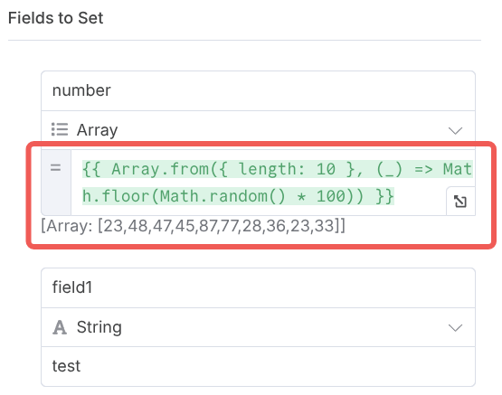

# n8n 中的代码

n8n 是一个低代码平台，意味着大部分时候可以通过拖拽节点来创建工作流，而不需要编写代码。
n8n 也支持通过代码来扩展工作流的功能。

n8n 中的代码在两个地方使用，一个是"代码节点"，另一个在表达式中。表达式只支持 JavaScript，
代码节点则支持 JavaScript 及 Python 语言。

## Expressions 表达式

Expressions 表达式是 n8n 中最常用的代码形式，被实现在 n8n 所有的节点中，用于处理数据或者引用
变量。通过表达式，工作流节点的配置参数可以基于前序节点的输出、工作流的元信息、以及环境变量来动态
生成。

Expressions 表达式中只允许 JavaScript 代码，其使用模板语言 [tournament](https://github.com/n8n-io/tournament)
来实现，实际代码包含在`{{ }}`中。同时 n8n 内置了一些函数与变量，可以方便的在表达式中使用。

在前序的章节中我们已经使用过表达式，如中**Edit Fields** 节点中，我们使用表达式来生成
随机数组：



```javascript
Array.from({ length: 10 }, (_) => Math.floor(Math.random() * 100));
```

需要注意的是，表达式只允许单个语句，意味着在表达式中不允许变量赋值、函数定义等语句。如下是无效
的表达式：

```plaintext
// This example is split over multiple lines for readability
// It's still invalid when formatted as a single line
{{
  function example() {
    let end = DateTime.fromISO('2017-03-13');
    let start = DateTime.fromISO('2017-02-13');
    let diffInMonths = end.diff(start, 'months');
    return diffInMonths.toObject();
  }
  example();
}}
```

上述例子如果期望在表达式中运行，可以改成如下形式：

```plaintext
{{DateTime.fromISO('2017-03-13').diff(DateTime.fromISO('2017-02-13'), 'months').toObject()}}
```

所以，对于复杂的表达式，建议使用**Code**节点来处理。

## Code 节点

Code 节点允许用户编写 JavaScript 或 Python 代码来处理数据。Code 节点有两种运行模式，

1. **Run Once for All Items**：默认模式，所有输入数据会作为数组传递给代码，代码只执行一次
2. **Run Once for Each Item**：针对每个输入的数据项都运行代码

> Python 代码使用 JavaScript 的[pyodide](https://pyodide.org/en/stable/)库来执行，
> 其执行效率低于 JavaScript 代码。所以如果追求极致的性能，建议使用 JavaScript 代码。

Code 节点出于安全的考虑，不允许读写系统文件以及发起 HTTP 请求，相关的操作需要通过 n8n 的其他
节点来实现。

如果想调试代码，或者观测代码处理过程中的数据，可以通过`console.log()`或者`print()`，将调试
信息输出到浏览器控制台中。

### 内置变量与函数

n8n 内置了一些函数与变量，可以方便的在代码中使用，JavaScript 以及 Python 使用不同
的命名方式进行变量获取，JavaScript 使用`$`前缀来引用内部变量，Python 使用`_`前缀。
如下是一些常用的变量（所有变量列表可以参考官方文档<https://docs.n8n.io/code/builtin/overview/>）：

| JavaScript               | Python                   | 描述                                                |
| ------------------------ | ------------------------ | --------------------------------------------------- |
| `$input.item`            | `_input.item`            | 当前节点关联的输入数据                              |
| `$input.all()`           | `_input.all()`           | 当前节点关联的所有输入                              |
| `$input.first()`         | `_input.first()`         | 当前节点关联的第一个数据项                          |
| `$json`                  | `_json`                  | `$input.item.json`或者`_input.item.json` 的快速访问 |
| `$("<node-name>").all()` | `_("<node-name>").all()` | 获取特定节点的全部输入                              |
| `$now`                   | `_now`                   | 当前时间，`DateTime.now()`                          |

Code 节点的返回需要符合 n8n 要求的数据结构，即返回一个数组，数组中的每一项为一个对象，对象中
包含`json`字段。在最新的 n8n 版本中，n8n 对返回的数据做了部分自动补全，如添加缺失的`json`字段，
或者将返回的对象包成单一数据数组。如下两种返回方式是等效的：

```javascript
return [{ json: { name: "John" } }];
return { name: "John" };
```

### 引入外部库

如果需要在 Code 节点中引入外部库，JavaScript 与 Python 的处理方式不同。

对于 Python 而言，n8n 使用 pyodide 库支持相关的代码执行，pyodide 本身有受限制的内置库，
包含常见的如`numpy`、`pandas`、`beautifulsoup4`等库。pyodide 库的完整列表如下：
<https://pyodide.org/en/stable/usage/packages-in-pyodide.html>。
在 Python 代码节点中第一次`import`相关的库会自动下载。

> 需要注意的是，官方在处理安全性问题时限制了部分库的引用，导致 n8n 中间部分版本 pyodide 支持
> 的库无法使用，n8n 实例需要升级到**1.102.0**版本以上正常使用，详细信息可以参考
> <https://github.com/n8n-io/n8n/issues/16532>

对于 JavaScript 而言，出于安全性考虑，n8n 需要配置环境变量来允许引入外部库。如需要`moment`
及`lodash`库，可以配置环境变量 `NODE_FUNCTION_ALLOW_EXTERNAL=moment,lodash`。

## 参考示例

以下是一个使用 Code 节点的示例，包括 JavaScript 及 Python 两个代码节点，外部库的引入，调试
信息，以及返回数据的处理

<n8n-workflow src='../workflows/c03/n8n_code_node.json' />

另外附上官方文档供参考：

- [Expressions](https://docs.n8n.io/code/expressions/)
- [Code Node](https://docs.n8n.io/code/code-node/)
- [Build in method and variable](https://docs.n8n.io/code/builtin/overview/)
- [Enable modules in code node](https://docs.n8n.io/hosting/configuration/configuration-examples/modules-in-code-node/)
