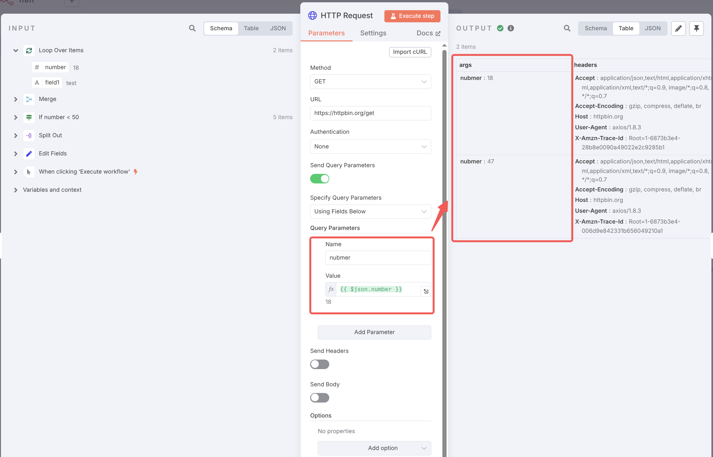

# n8n 核心节点

除了触发器节点，n8n 还包含许多核心节点，这些节点可以执行各种任务。本章节介绍相关的核心节点，包括
数据处理节点、控制流节点、HTTP 请求节点等。

## Data transformation 数据处理节点

数据是工作流流转的核心，数据处理节点用于对数据进行处理，包括数据拆分、合并、赋值等。
选择**Data transformation**大类，可以看到如下的数据处理节点列表：


本章节介绍其中的 `Edit Fields` 和 `Split Out` 节点。

### Edit Fields 变量赋值节点

使用 Edit Fields 来给工作流中的数据赋值。该节点可以更改已有的数据，或者添加新的数据。

该节点可以选择两种变量赋值模式：手动映射 Manual Mapping，和 JSON 输出模式。如下是手动映射模式，
通过指定字段的名称以及值来赋值：


其等价的 JSON 输出模式的代码如下：

```json
{
    "number": {{ Array.from({ length: 10 }, (_) => Math.floor(Math.random() * 100)) }}
}
```

该例子中将`number`字段的值赋值为一个长度为 10 的随机数组。

### Split Out 数据拆分节点

Split Out 节点用于将包含数组字段的数据拆分为多个部分。**Include**配置项作用为您希望 n8n
如何在每个新单独项中保留输入数据中的其他字段。

- **No Other Fields**: 不包含其他字段
- **All Other Fields**: 包含所有其他字段
- **Selected Other Fields**: 指定包含的字段

如下是 Split Out 节点的配置示例，节点输入为：

```json
{
  "number": [81, 61, 53, 18, 47, 56, 63, 45, 25, 15],
  "field1": "test"
}
```

Split Out 将其中`number`字段拆分为 10 项，且根据**Selected Other Fields**配置的字段，
将`field1`字段包含在每一项中。


## 控制流节点

控制流节点用于控制流程的执行，包括条件判断、循环、分支等。选择**Flow**大类，可以看到如下的控制
流节点列表：


本节介绍其中的 `If` 和 `Merge` 以及 `Loop` 节点。

### If 条件判断节点

If 节点用于根据比较操作有条件地拆分工作流程。不同的数据类型支持不同的比较操作，常见的数据类型
如`String`, `Number`, `Boolean`, `Array`, `Object`等。If 节点还支持添加多个条件判断，
对于所有的条件，支持选择`AND`和`OR`两种逻辑运算符，表示所有条件必须满足或者满足任意一个条件。

如下是 If 节点的配置示例，节点通过判断输入的`number`值是否小于 50 将数据拆分为`True Branch`
和`False Branch`两个分支。


### Merge 数据合并节点

Merge 节点用于将多个数据项合并为一个数据项。该节点可以合并来自多个节点的数据，该节点会等待所有
上游节点数据可用后执行。Merge 节点典型的应用场景如合并获取的多个网页内容然后提交至 AI 节点进行
总结。

Merge 节点有如下几种数据合并方式：

1. Append - 追加，保留所有数据，并将数据项依次追加到结果中
2. Combine - 合并，基于**Combine By**选项决定如何合并数据
3. SQL Query - 使用 SQL 语言来合并数据
4. Choose Branch - 选择分支，选择输入 1 或者输入 2 的数据，或者输出空项

如下是 Merge 节点的配置示例，节点使用追加模式将 If 节点两个分支的数据项合并为一个数据项。


### Loop 循环节点

默认情况下，n8n 节点设计为循环处理输入项列表，所以一般情况下通常在工作流中不需要循环节点。
但一些特殊情况下，如节点只处理输入项列表中的第一个值（如 RSS 节点），此时可以使用 Loop 节点。

如下是 Loop 节点的配置示例，节点使用循环处理输入的`number`字段，每批次处理 2 个数据项。


## HTTP 请求节点

HTTP 请求节点是 n8n 中最灵活的节点之一。它允许您进行 HTTP 请求，以从任何具有 REST API 的
应用程序或服务中查询数据。您可以将 HTTP 请求节点用作常规节点或附加到 AI Agent 节点以作为工具
使用。

HTTP 请求节点支持常见的 HTTP 相关的各项配置项，如请求方法、请求 URL、认证、请求头、请求体等。

如下是 HTTP 请求节点的配置示例，节点使用 GET 方法请求 <https://httpbin.org> 服务的 API，
并传递`nubmer`字段作为 URL 的查询参数。



## 参考示例

如上介绍的所有节点可以参考如下的工作流配置

<n8n-workflow src='../workflows/c03/n8n_node_demo.json'/>

其完整的执行结果如下


另外附上官方文档供参考：

- [Edit Fields (Set)](https://docs.n8n.io/integrations/builtin/core-nodes/n8n-nodes-base.set/)
- [Split Out](https://docs.n8n.io/integrations/builtin/core-nodes/n8n-nodes-base.splitout/)
- [If](https://docs.n8n.io/integrations/builtin/core-nodes/n8n-nodes-base.if/)
- [Merge](https://docs.n8n.io/integrations/builtin/core-nodes/n8n-nodes-base.merge/)
- [Loop Over Items](https://docs.n8n.io/integrations/builtin/core-nodes/n8n-nodes-base.splitinbatches/)
- [HTTP Request node](https://docs.n8n.io/integrations/builtin/core-nodes/n8n-nodes-base.httprequest/)
