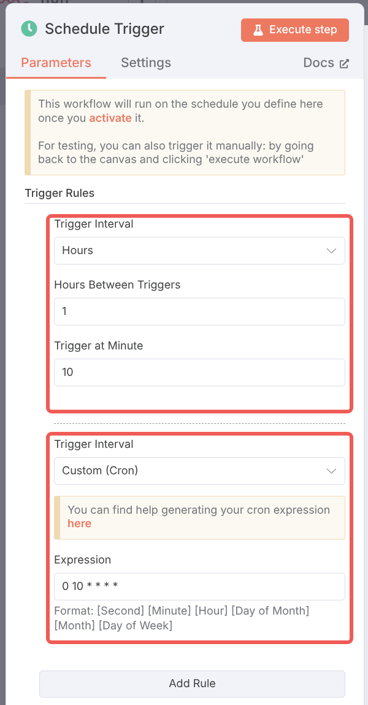

# n8n 节点

n8n 节点（nodes）是 n8n 的核心，它们是执行特定任务的小组件。每个节点代表一个操作，例如从数据
库中获取数据、发送 HTTP 请求或处理 JSON 数据。

n8n 节点分为 trigger 节点和 action 节点。trigger 节点用于启动工作流，而 action 节点用于执行任务。
n8n 内置了很多节点，包括核心节点、集群节点、三方集成节点，同时也支持用户安装社区节点或者开发
自定义节点。

本章节主要介绍核心节点。

## Trigger 节点

任何工作流都需要一个 trigger 节点作为起始节点，一个工作流可以有多个 trigger 节点。
在我们开始构建工作流时，需要先选择一个 trigger 节点。点击**Add first step...**，工作区
右部会显示所有可用的 trigger 节点。


### Manual Trigger 手动触发器

Manual Trigger 节点是最简单的 trigger 节点，它不需要任何输入，只需要点击执行按钮即可触发工作流。
Manual Trigger 节点通常用于测试工作流或者需要手动触发的工作流。

添加 Manual Trigger 节点后，点击**Execute workflow**按钮即可触发工作流。Manual Trigger
节点没有输出，样式如下

<n8n-workflow src='../workflows/c03/node_manual_trigger.json'/>

### Schedule Trigger 定时触发器

Schedule Trigger 节点用于定时触发工作流，它支持多种定时策略，包括分钟间隔、小时间隔、天间隔等，
以及 Cron 类型的配置。如下展示了 Schedule Trigger 节点的配置，其两个规则是等价的。



需要注意的是，Schedule Trigger 触发器的执行时间依赖系统配置的时区信息。对于私有化部署的
n8n，可以通过`GENERIC_TIMEZONE`和`TZ`环境变量来配置时区信息。官方 SaaS 版 n8n 的时区可以
在管理界面<https://app.n8n.cloud/manage>配置


同时 n8n 支持单个工作流配置不同的时区，可以在工作流设置中配置。右上角点击三点菜单，点击
**Settings**，在**Timezone**配置项中选择时区即可。


点击**Execute workflow**按钮即可触发工作流。Schedule Trigger 节点输出触发当前工作流的
时间信息，如下

```json
[
  {
    "timestamp": "2025-07-09T16:10:00.000+00:00",
    "Readable date": "July 9th 2025, 4:10:00 pm",
    "Readable time": "4:10:00 pm",
    "Day of week": "Wednesday",
    "Year": "2025",
    "Month": "July",
    "Day of month": "09",
    "Hour": "16",
    "Minute": "10",
    "Second": "00",
    "Timezone": "UTC (UTC+00:00)"
  }
]
```

<n8n-workflow src='../workflows/c03/node_schedule_trigger.json'/>
