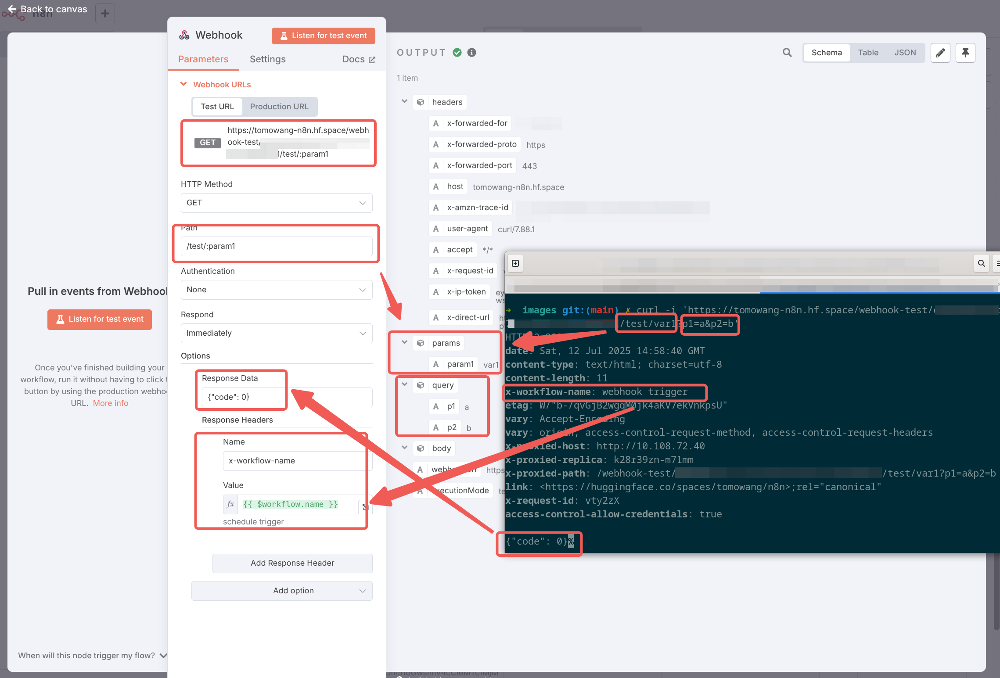

# n8n 触发器节点

n8n 节点（nodes）是 n8n 的核心，它们是执行特定任务的小组件。每个节点代表一个操作，例如从数据
库中获取数据、发送 HTTP 请求或处理 JSON 数据。

n8n 节点分为 trigger 节点和 action 节点。trigger 节点用于启动工作流，而 action 节点用于执行任务。
n8n 内置了很多节点，包括核心节点、集群节点、三方集成节点，同时也支持用户安装社区节点或者开发
自定义节点。

本章节主要介绍触发器类型的节点。

任何工作流都需要一个 trigger 节点作为起始节点，一个工作流可以有多个 trigger 节点。
在我们开始构建工作流时，需要先选择一个 trigger 节点。点击**Add first step...** ，工作区
右部会显示所有可用的 trigger 节点。


## Manual Trigger 手动触发器

Manual Trigger 节点是最简单的 trigger 节点，它不需要任何输入，只需要点击执行按钮即可触发工作流。
Manual Trigger 节点通常用于测试工作流或者需要手动触发的工作流。

添加 Manual Trigger 节点后，点击**Execute workflow**按钮即可触发工作流。Manual Trigger
节点没有输出，样式如下

<n8n-workflow src='../workflows/c03/node_manual_trigger.json'/>

## Schedule Trigger 定时触发器

Schedule Trigger 节点用于定时触发工作流，它支持多种定时策略，包括分钟间隔、小时间隔、天间隔等，
以及 Cron 类型的配置。如下展示了 Schedule Trigger 节点的配置，其两个规则是等价的。


需要注意的是，Schedule Trigger 触发器的执行时间依赖系统配置的时区信息。对于私有化部署的
n8n，可以通过`GENERIC_TIMEZONE`和`TZ`环境变量来配置时区信息。官方 SaaS 版 n8n 的时区可以
在管理界面<https://app.n8n.cloud/manage>配置


同时 n8n 支持单个工作流配置不同的时区，可以在工作流设置中配置。右上角点击三点菜单，点击
**Settings**，在**Timezone**配置项中选择时区即可。


点击**Execute workflow**按钮即可触发工作流。Schedule Trigger 节点输出触发当前工作流的
时间信息，如下

```json
[
  {
    "timestamp": "2025-07-09T16:10:00.000+00:00",
    "Readable date": "July 9th 2025, 4:10:00 pm",
    "Readable time": "4:10:00 pm",
    "Day of week": "Wednesday",
    "Year": "2025",
    "Month": "July",
    "Day of month": "09",
    "Hour": "16",
    "Minute": "10",
    "Second": "00",
    "Timezone": "UTC (UTC+00:00)"
  }
]
```

<n8n-workflow src='../workflows/c03/node_schedule_trigger.json'/>

## Webhook Trigger Webhook 触发器

Webhook Trigger 节点用于接收 HTTP 请求，从应用程序和服务接收数据触发工作流。
添加触发节点 **On webhook call**，会展示如下配置界面


n8n 为 webhook 触发器生成了一个唯一的 URL 路径，测试 URL 与正式的 URL 有所区别，测试 URL
的路径为`webhook-test`，正式 URL 中无 `test`，默认的路径为随机的 UUID。其他的配置项
包括 HTTP 方法，Authentication 方式，以及响应方式等。

点击配置面板右上角的**Listen for test event**，面板左侧会展示测试监听地址，即为配置的回调
地址，通过浏览器访问该地址，会看到如下 JSON 返回

```json
{
  "message": "Workflow was started"
}
```

> 需要注意的是，该地址访问一次后会失效，需要再次点击**Listen for test event**重新监听。

对于 Path 配置项，我们可以添加路径路由或者参数，支持的格式如下

- `/:variable`
- `/path/:variable`
- `/:variable/path`
- `/:variable1/path/:variable2`
- `/:variable1/:variable2`

另外，我们可以添加额外的 URL 查询参数进行请求，如在 URL 结尾添加`?p1=a&p2=b` 参数。

对于返回 webhook 触发器的返回，n8n 提供三种方式

- 立即 Immediately：Webhook 节点返回响应代码和消息`{"message":"Workflow was started"}`。
- 当最后一个节点完成时 When Last Node Finishes：Webhook 节点返回响应代码和在工作流程中最后一个执行的节点的数据输出。
- 使用'Respond to Webhook'节点：Webhook 节点按‘响应 Webhook’节点中的定义进行响应。

对于简单的场景，我们可以使用 **Immediately：Webhook** 选项，配合额外的配置进行处理。n8n
支持如下配置项

- `Allowed Origins (CORS)`
- `Field Name for Binary Data`
- `Ignore Bots`
- `IP(s) Whitelist`
- `No Response Body`
- `Raw Body`
- `Response Code`
- `Response Data`
- `Response Headers`

一个完整的测试请求 URL 例子：`https://n8n.example.com/webhook-test/UUID/test/v1?p1=a&p2=b`，
其中`/test/v1`中的`v1`为路径参数。

使用 CURL 命令，请求该地址，最终展示的配置及节点输出如下



具体配置可以参考如下的节点

<n8n-workflow src='../workflows/c03/node_webhook_trigger.json'/>

对于复杂场景，如响应内容需要基于工作流运行情况进行调整，或者需要使用工作流最后节点的输出，
可以使用**Respond to Webhook**或者**When Last Node Finishes**的响应方式进行定制。

## Chat Trigger 聊天触发器

聊天触发器的使用场景为聊天机器人或者其他对话形式的交互工作流。在工作流中添加
**On chat message**节点来使用该触发器。聊天触发器需要连接 Agent 节点或者集群节点。

> 需要注意的是，每次用户发送消息都会触发工作流，如果是 SaaS 版本，需要注意套餐的配额限制。

聊天触发器可以视为一种特殊的 webhook 触发器。如果只希望在工作区人工触发，可以设置聊天触发器为
非公开访问。如果配置允许公开访问，n8n 将生成一个唯一的 URL，用户可以通过该 URL 打开聊天交互
界面（Hosted Chat 模式，且需要将工作流状态设置为 Active）。

聊天触发器配置示例如下：


通过浏览器访问聊天触发器提供的 URL，可以看到一个简易的聊天界面，输入问题可以触发工作流，然后
展示工作流的输出结果。


查看工作流的执行，可以看到执行记录和日志


完整的工作流示例如下

<n8n-workflow src='../workflows/c03/node_chat_trigger.json'/>
