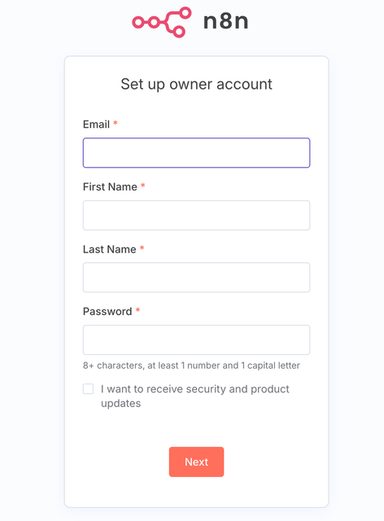
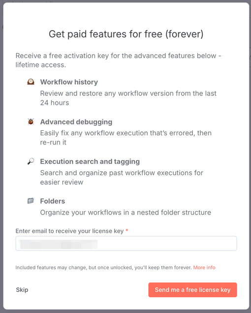
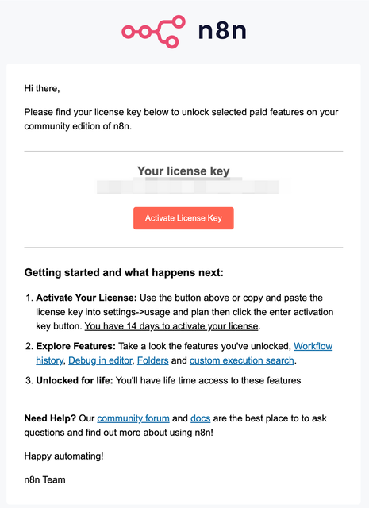
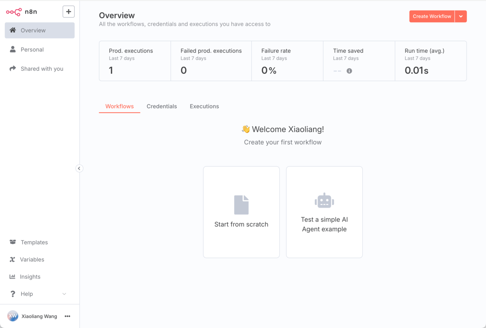
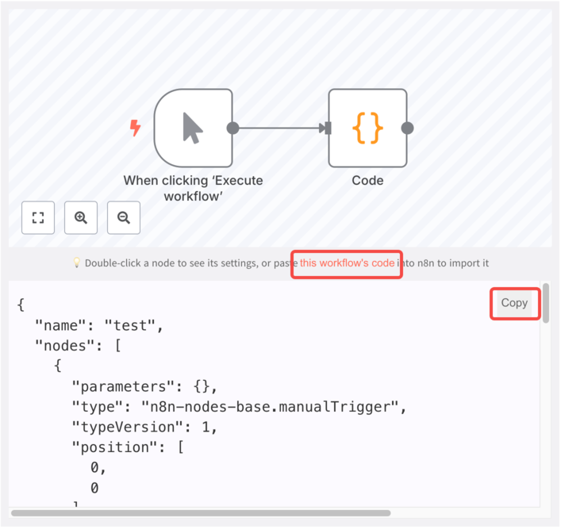
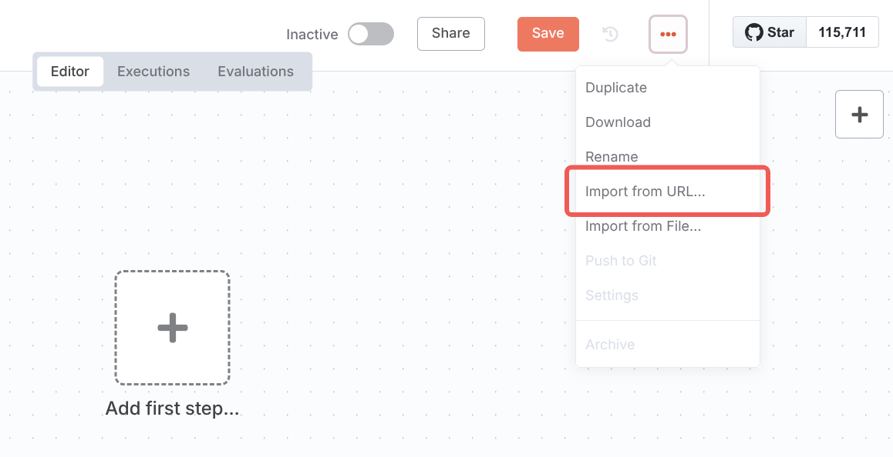
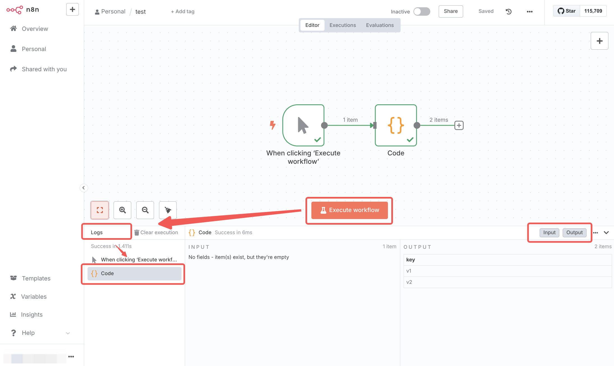
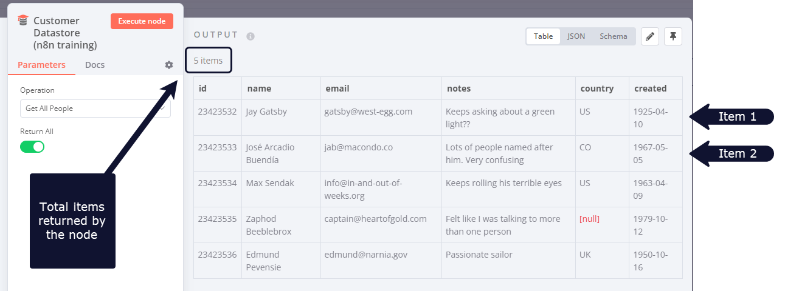

# n8n 平台介绍

对于本地，云主机，或者 Huggingface space 部署的 n8n 平台，我们需要创建账户。一般地址是类似
如下的格式：

- 本地 - http://127.0.0.1:5678/
- 云主机 - https://n8n.example.com/
- Huggingface space - https://profile-n8n.hf.space/

## 注册账户

- 打开对应的地址，弹出注册页面，按表单填写自己的用户名、邮箱、密码等，点击**Next**

  

- 填写自己的邮箱，接受免费 license

  

- 检查邮箱，复制 license 信息

  

## 界面介绍

登录到系统后，我们可以看到如下的页面



其中主页面上方部分展示系统中工作流的运行统计情况，下部分为工作流、凭据、工作流执行列表等信息。

我们以下列工作流为示例，导入到 n8n 系统中，展示 n8n 系统的界面和功能。

<n8n-workflow src='workflows/c03/test.json' />

在 n8n 系统中，点击 **Start from scratch**，介绍两种导入方式：

1. 点击示例工作流下面**the workflow's code**以展示工作流代码，点击 Copy 复制代码。

   

使用复制快捷键`Ctrl+V`（windows 系统）或者`Command (⌘) + V`（mac 系统）

2. 拷贝工作流下方的链接，点击 n8n 系统右上方菜单点击**Import from URL**，粘贴链接。

   

我们可以看到对应的测试工作流已经展示到 n8n 系统中。需要注意的是 n8n 的工作流不会自动保存，需要
手动点击**Save**按钮或者使用保存快捷键以保存工作流。

点击**Execute workflow**，我们可以看到工作流开始执行，并在界面下方日志区域看到执行过程的输入
输出。



完成工作流的偏排后，可以通过右上角导航栏中的 Active 按钮来启动工作流。

## 数据结构与执行过程

在 n8n 工作流中，节点间使用对象数组来传递数据，其大致结构如下

```json
[
  {
    // For most data:
    // Wrap each item in another object, with the key 'json'
    json: {
      // Example data
      apple: "beets",
      carrot: {
        dill: 1,
      },
    },
    // For binary data:
    // Wrap each item in another object, with the key 'binary'
    binary: {
      // Example data
      "apple-picture": {
        data: "....", // Base64 encoded binary data (required)
        mimeType: "image/png", // Best practice to set if possible (optional)
        fileExtension: "png", // Best practice to set if possible (optional)
        fileName: "example.png", // Best practice to set if possible (optional)
      },
    },
  },
];
```

`json`字段表示文本相关数据，`binary`字段表示二进制数据，如图片、文件等。其每个数组项可以看作
数据库表中的一行数据，如下图所示节点输出了 5 条数据



针对每个数据项需要的操作，n8n 会自动进行处理，这意味着大部分场景不需要在工作流程中专门构建循环。
对于数据或者执行流更复杂的控制，将会在后续章节中做更深入的介绍。
