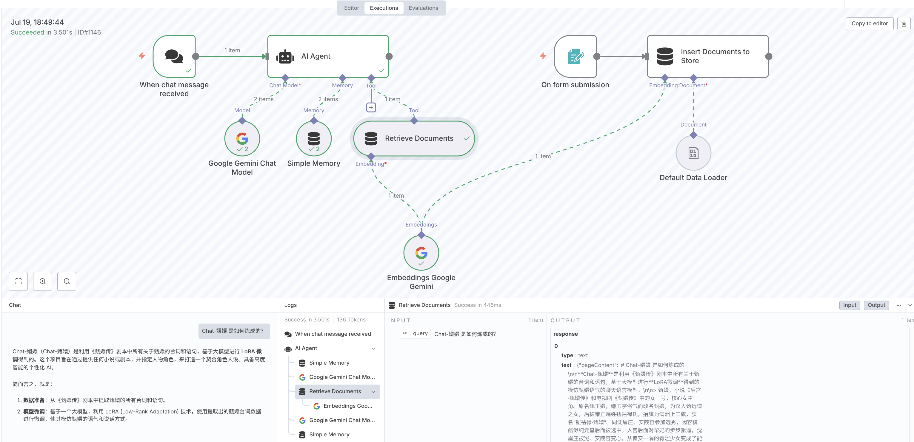

# n8n AI 相关概念

n8n 一大优势就是其内置了 AI 相关的节点和处理方式，可以方便用户构建 AI 相关的应用，包括
AI 聊天机器人、文本总结、AI Agent 等。

## Cluster nodes 集群节点

n8n 中，集群节点 (Cluster nodes) 是一组一起工作的节点组，它们由一个根节点 (root node) 和
一个或多个扩展节点功能的子节点 (sub-nodes) 组成。AI 相关的功能由集群节点实现。

Cluster nodes 的根节点一般分 Chian 及 Agent 类型。
Chain 是一种简单的 LLM 集成方式，用来串联工作流中的其他节点，且不支持记忆功能。

以下是 n8n 中内置的 Chain 节点：

- [Basic LLM Chain](https://docs.n8n.io/integrations/builtin/cluster-nodes/root-nodes/n8n-nodes-langchain.chainllm/)
- [Retrieval Q&A Chain](https://docs.n8n.io/integrations/builtin/cluster-nodes/root-nodes/n8n-nodes-langchain.chainretrievalqa/)
- [Summarization Chain](https://docs.n8n.io/integrations/builtin/cluster-nodes/root-nodes/n8n-nodes-langchain.chainsummarization/)
- [Sentiment Analysis](https://docs.n8n.io/integrations/builtin/cluster-nodes/root-nodes/n8n-nodes-langchain.sentimentanalysis/)
- [Text Classifier](https://docs.n8n.io/integrations/builtin/cluster-nodes/root-nodes/n8n-nodes-langchain.text-classifier/)

Agent 节点则可以访问更多的工具，以及可以根据用户输入和上下文信息执行任务，并通过工具返回的信息做
执行的决策。可以认为 Agent 是一种知道如何做出决策的 Chain 节点。

以下是 n8n 中内置的 root node 列表：

<n8n-workflow src='workflows/c04/n8n_root_nodes.json' />

## Memory 记忆

在构建 AI 聊天机器人时，记忆 (Memory) 是一个重要的概念，它允许 AI 模型记住之前对话的内容，以便
在后续的对话中使用这些信息。记忆可以帮助 AI 模型更好地理解用户的意图，并生成更准确和相关的回答。

如果没有记忆，AI 将无法记住上下文，如下是一个没有记忆的 AI 聊天示例：

在 Agent 节点上，我们可以添加记忆节点，以便 AI 模型记住之前对话的内容。如下是几种 n8n 支持的
常见记忆体

- Simple Memory
- MongoDB Chat Memory
- Redis Chat Memory
- Postgres Chat Memory

在测试的简单场景，我们选择 Simple Memory 即可。如下是添加了记忆之后的 AI 对话

从截图中我们可以看到，一次对话交互，Agent 节点与 Memory 交互了两次，分别是`loadMemoryVariables`
及`saveContext`，其中`loadMemoryVariables`用于加载记忆，`saveContext`用于保存记忆。

> Simple Memory 使用 worker 的内存存储记忆，在 n8n Queue 部署模式中队列分发无法确保每次到
> 相同的节点，所以对于复杂的模式请使用外部的记忆体，如 Redis Chat Memory。

一个简单的带记忆的工作流如下：

<n8n-workflow src='workflows/c04/n8n_chat_with_memory.json' />

## RAG

RAG (Retrieval-Augmented Generation) 是一种结合了检索和生成两种方法的 AI 模型，它能够从大量
的文本数据中检索相关信息，并将这些信息与生成模型结合，以生成更准确和相关的回答。

RAG 模型通常由两部分组成：检索模块和生成模块。检索模块负责从大量文本数据中检索相关信息，生成
模块则负责根据检索到的信息生成回答。

n8n 中的 RAG 系统通常依赖 vector store 来进行外部数据的存储与检索。vector store 向量存储，
或称 vector database 向量数据库，是一种用于存储 embedding 向量的数据库，它能够根据向量之间的
相似度进行检索。

在 n8n 中，RAG 一般包括两个部分，一是内容的上传，二是内容的查询。下面我们通过例子来演示一个
简单的 RAG 系统。

### 内容上传

我们使用 **On form submission** 作为触发节点来上传文件，通过编辑节点中的表单配置，添加文件
类型字段，如下所示：

通过添加 **Simple Vector Store** 节点，选择 **Insert Documents** 操作，将表单中的文件
上传到 vector store 中，如下所示：

**Simple Vector Store** 也是一种集群节点，需要关联一个 **Embedding Model** 节点，
以及一个文档加载节点。**Embedding Model**节点用于将文档转化为向量，
这里我们使用 Gemini 的 `text-embedding-004` 模型，文档加载节点我们使用
**Default Data Loader**节点。**Default Data Loader** 节点中的
**Input Data Field Name** 配置需要与 **On form submission**
节点中的表单字段名一致。

这样我们就构建了一个文件上传工作流，将用户上传的文件转化为向量并存储到 vector store 中。
点击执行，n8n 将弹出一个表达，并展示之前配置的文件选择输入框，如下所示：

选择文件后，点击提交，n8n 将执行工作流，将文件上传到 vector store 中。在本例中，我们使用
[chat 嬛嬛.txt](/c04/data/chat嬛嬛.txt ":ignore")作为文档示例。

### 内容检索

接下来，我们构建一个内容检索工作流，通过用户输入的问题，以及 AI Agent 的大模型，
从 vector store 中检索相关内容并完成回答。

我们使用 **On chat message** 作为触发节点，并关联 AI Agent 节点，在 AI Agent 节点中的
`Tool`关联**Simple Vector Store**作为工具，配置 **Retrieve Documents (As Tool for AI Agent)**
作为操作，同时需要关联与之前内容上传工作流相同的 **Embedding Model** 节点。

我们可以断开 AI Agent 节点与 **Simple Vector Store** 节点的连接，来测试没有 RAG 情况下的
对话效果。如下分别是有 RAG 和没有 RAG 的对话效果：

可以看到在有 RAG 的情况下，AI Agent 能够根据用户的问题，从 vector store 中检索相关内容，并
生成更准确和相关的回答。

### 参考

如下是上述示例的完整的工作流

<n8n-workflow src='workflows/c04/n8n_rag.json' />

官方文档参考<https://docs.n8n.io/advanced-ai/rag-in-n8n/>

## Tools 工具

在上述示例中，我们使用 Simple Vector Store 作为 AI Agent 节点的工具。在 AI 场景中，
工具有着特殊的意义，它能够帮助 AI Agent 补充额外的 LLM 不支持的能力，如搜索引擎搜索、
数据库查询、天气信息查询等。

一个 AI Agent 可以关联多个工具，如下所示我们添加了两个工具，**Date & Time Tool** 和
**Calculator**，分别用于查询日期和时间，以及计算器。

完整的工作流如下：

<n8n-workflow src='workflows/c04/n8n_tools.json' />

## MCP

n8n 支持 MCP (Model Context Protocol) 协议，在 n8n 中可以将 MCP 看作一种特殊的工具。

MCP (Model Context Protocol) 是一种开放协议，标准化了应用程序如何为 LLM 提供上下文。
可以把 MCP 看作是 AI 应用的 USB-C 端口。

_Source: https://norahsakal.com/blog/mcp-vs-api-model-context-protocol-explained/_

MCP 的通讯主要包括两个部分，一个是作为工具供 AI Agent 调用的 Client，另外是作为服务端的
Server 提供实际的服务。MCP 协议定义了两种 Client 与 Server 之间的通讯机制：

- [stdio](https://modelcontextprotocol.io/specification/2025-06-18/basic/transports#stdio) - 标准输入和标准输出之间的通信
- [Streamable HTTP](https://modelcontextprotocol.io/specification/2025-06-18/basic/transports#streamable-http) - 流式 HTTP 请求和响应

n8n 中主要通过 Streamable HTTP 进行通讯，其中 MCP Client 作为 AI Agent 节点的工具，
MCP Server 为单独的 **MCP Server Trigger** 节点，将 n8n 中集成的工具转成 MCP Server
服务供 MCP Client 调用。

本节我们使用 GitHub 工具为例，展示 n8n 中 MCP 的使用。

首先我们申请一个 GitHub 的 access token，用于 GitHub API 的调用：

- 访问开发者设置页面 <https://github.com/settings/tokens>
- 点击右上角的 Generate new token 按钮，选择 classic
- 在 Note 中输入一个名称，如 n8n-github
- 出于安全考虑，我们只访问公开的仓库信息，所以不选择任何权限，点击 Generate token 按钮
- 复制生成的 token，保存到安全的地方

接下来，我们构建一个工作流，将 GitHub API 转成 MCP Server 服务，供 AI Agent 调用。

添加 **MCP Server Trigger** 节点，获取其生产地址，格式类似<https://n8n.example.com/mcp/UUID>

在 **MCP Server Trigger** 工具选项中，选择 **GitHub** 作为工具，打开 **GitHub** 节点的
配置项，我们选择新建 **Credential**，并输入之前申请的 GitHub access token。
资源 Resource 选择 **Repository**，操作 Operation 选择 **Get**。**Repository Owner**
出于测试目的，固定为 `datawhalechina`，**Repository Name** 我们使用 n8n 的
[**Let the model define this parameter**](https://docs.n8n.io/advanced-ai/examples/using-the-fromai-function/) 功能，
让 AI Agent 填充参数。具体完整的配置如下

然后我们添加 **On chat message** 节点，并关联 AI Agent 节点，在 AI Agent 节点中的工具选项
中，选择 **MCP Client**，在弹出的配置窗口中，将之前获取的 MCP Server Trigger 生产地址
填入 **SSE Endpoint** 配置项。

最终我们保存工作流并将其状态设置为 active。在工作流的聊天测试框，输入问题，可以看到完整的调用
过程，并得到关于问题中 GitHub 仓库信息的回答，如下所示：

完整的工作流如下：

<n8n-workflow src='workflows/c04/n8n_mcp.json' />

## 总结

本节我们介绍了 n8n 中 集群节点、记忆、RAG、Tools 和 MCP 的使用，通过这些功能，我们可以构建
一个完整的 AI 应用。如果上述的场景不能满足需求，n8n 还提供了[`LangChain Code Node`](https://docs.n8n.io/integrations/builtin/cluster-nodes/root-nodes/n8n-nodes-langchain.code/)，
可以编写自定义的 LangChain 代码，实现更复杂的 AI 应用。
