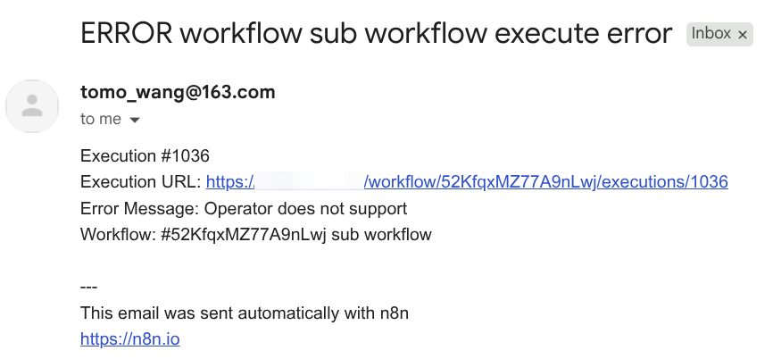

本章节介绍 n8n 中的子工作流和错误处理。

## n8n 子工作流

n8n 支持从一个工作流调用另一个工作流。子工作流可以用于将复杂的任务分解为更小的、可重用的部分。
工作流通过 **Execute Workflow** 来调用子工作流，子工作流通过 **Execute Sub-Workflow Trigger** 来触发。

我们可以创建独立的子工作流，也可以将子工作流嵌入到主工作流中。下面的例子我们将以一个简单的计算器
子工作流为例，演示如何创建和使用子工作流，该计算器子工作流支持加、减、乘、除四种运算。

在新建工作流时，添加节点，选择**When Executed by Another Workflow**作为触发节点。

在弹出的工作流配置窗口中，我们定义工作流接收的参数。这里我们定义了三个参数，分别是 `a`、`b` 和
`operator`，分别表示两个操作数和运算符。

后续通过 **Switch** 节点，根据 `operator` 的值，分别调用不同的运算节点。如下是完整的子工作流

为了演示，我们可以中同一个工作流添加额外的触发节点来模拟主工作流，在主工作流的中，添加
**Execute Workflow** 节点，将会弹出配置窗口。我们需要选择需要调用的子工作流，这里我们选择
**From list**模式，并在下拉框中选择当前的工作流。选择工作流后，将展示该子工作流的参数列表，
我们从前序节点中拖拽参数到子工作流对应的参数，完成子工作流的参数配置。

触发主工作流，可以看到子工作流被调用，并返回了计算结果。在工作流的执行日志中，可以看到主工作流
及子工作流的执行日志。

完整的示例参考下面的工作流

<n8n-workflow src='workflows/c04/n8n_sub_workflow.json' />

## n8n 错误处理

在我们设计的工作流时，考虑容错是非常重要的。n8n 使用**Error Trigger**节点来触发错误处理逻辑。

错误处理是独立的工作流，以下是配置步骤：

1. 创建新的工作流，选择**Error Trigger**作为触发节点，**Error Trigger**节点没有配置项。
2. 添加后续的节点，如发送邮件**Email**节点，配置邮件内容，如错误信息。保存工作流并命名，
   如**error notify**。如下是**Error Trigger**节点的数据示例，我们可以在后续的节点中通过
   表达式来引用这些数据，如触发错误的工作流名称、执行 URL 等。

   

3. 在需要错误处理的工作流中，点击右上角三点菜单中的**Setting**菜单项。
4. 在弹出的配置窗口中，在**Error Workflow**的配置项中选择我们刚刚新建的错误处理工作流，保存配置。

   

关于通知，示例中使用邮件发送服务，我们需要配置 SMTP，以网易邮箱为例，登录网易邮箱的网页版，
在导航菜单中选择**设置**，在弹出的页面中选择**POP3/SMTP/IMAP**，选择开启 IMAP/SMTP
服务，在授权密码管理部分，选择新增授权码，授权码即为三方使用网易邮箱时的密码。
网易邮箱的 SMTP 地址为**smtp.163.com**，端口号为**465**。

当然我们也可以使用其他通知服务，如飞书、企业微信等。

现在，当工作流中发生错误时，n8n 将自动调用我们配置的错误处理工作流。我们可以在前序的子工作流的
示例中通过更改参数值，模拟错误，触发错误处理工作流。最终将收到如下示例的邮件

