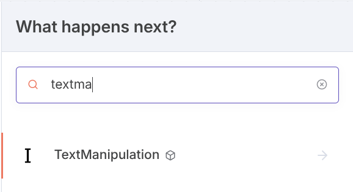
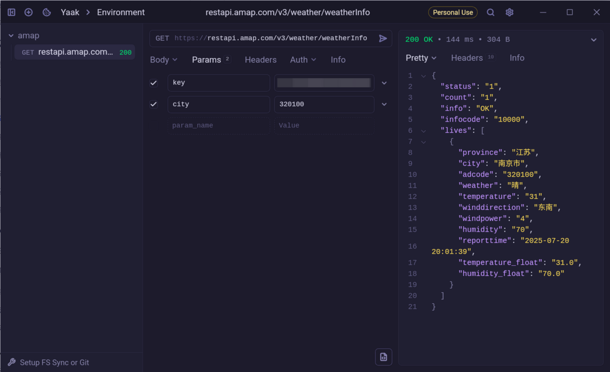
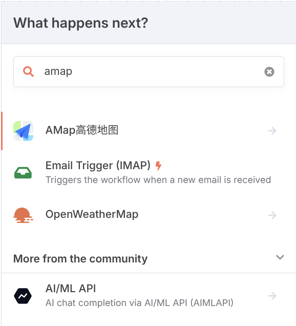
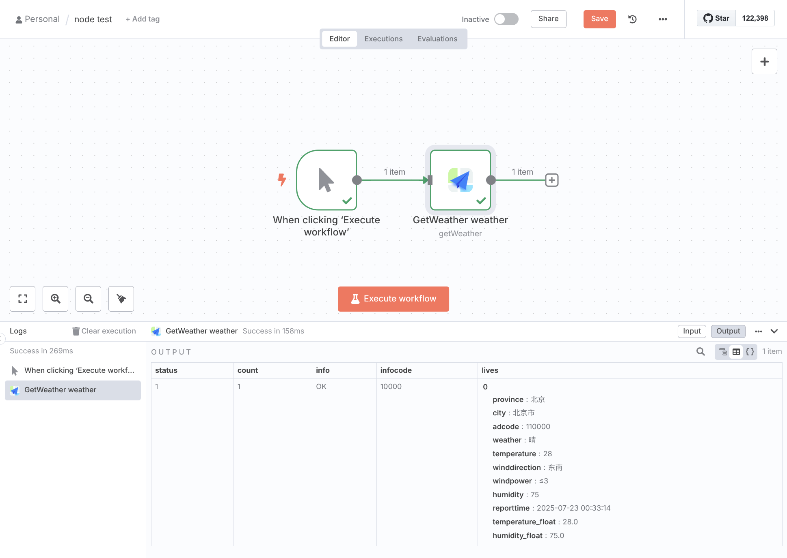

# n8n 社区节点与节点开发

n8n 官方提供工具和接口可以方便地创建自定义的节点，同时社区也构建了很多有用的节点，
这些节点可以方便地集成到 n8n 工作流中。

## 社区节点

n8n 本身已经内置了很多三方应用集成的节点，例如 GitHub、Slack、Jira 等，这些节点都是 n8n
官方维护的节点，代码位于官方仓库中[https://github.com/n8n-io/n8n/tree/master/packages/nodes-base/nodes](https://github.com/n8n-io/n8n/tree/master/packages/nodes-base/nodes)。

社区节点是 n8n 社区贡献的节点，由社区成员开发并维护，发布在 npm 上。安装社区节点步骤如下：

1. 打开 n8n，点击左侧的 `Settings`，然后点击 `Community nodes`。
2. 在 `Community nodes` 页面中，搜索你需要的节点，点击 `Install a community node` 按钮。
3. n8n 弹出对话框，通过链接可以打开 npm 的搜索[https://www.npmjs.com/search?q=keywords%3An8n-community-node-package](https://www.npmjs.com/search?q=keywords%3An8n-community-node-package)。
4. 找到想要安装的节点，复制其 npm 包名，这里我们使用 `n8n-nodes-text-manipulation` 作为测试。
5. 回到 n8n 填入包名，勾选同意风险，点击 `Install` 按钮。

安装完成后，回到工作流编辑页面，添加节点时可以搜索到刚刚安装的社区节点



## 自定义节点开发

如果官方或者社区节点都没有你需要的节点，或者对于企业内部的服务需要与 n8n 集成，你可以自己开发一个节点。

n8n 官方提供了详细的文档和工具帮助开发者开发节点。以下我们以高德地图的天气服务为例，开发一个
天气服务节点。

### 申请高德地图 API Key

首先我们需要申请一个高德地图的 API Key。

1. 注册成为高德地图的开发者 [https://console.amap.com/dev/id/phone](https://console.amap.com/dev/id/phone)，完成个人认证
2. 通过开发者控制台[https://console.amap.com/dev/key/app](https://console.amap.com/dev/key/app)添加应用与 key，**服务平台** 可以选择 **Web 服务**

高德地图天气服务的 API 可以参考[https://lbs.amap.com/api/webservice/guide/api/weatherinfo](https://lbs.amap.com/api/webservice/guide/api/weatherinfo)。

| 参数名     | 含义             | 规则说明                                                                                       | 是否必须 | 缺省值 |
| ---------- | ---------------- | ---------------------------------------------------------------------------------------------- | -------- | ------ |
| key        | 请求服务权限标识 | 用户在高德地图官网[申请 web 服务 API 类型 KEY](https://lbs.amap.com/dev/)                      | 必填     | 无     |
| city       | 城市编码         | 输入城市的 adcode，adcode 信息可参考[城市编码表](https://lbs.amap.com/api/webservice/download) | 必填     | 无     |
| extensions | 气象类型         | 可选值：base/allbase:返回实况天气 all:返回预报天气                                             | 可选     | 无     |
| output     | 返回格式         | 可选值：JSON,XML                                                                               | 可选     | JSON   |

每月有 5000 次调用免费额度，可以满足测试需求。

通过 API key 以及文档说明，我们可以测试一下 API 的调用，如下是测试获取当前南京天气的示例：



### 节点开发

官方提供了节点模板仓库，可以方便地创建一个节点项目。

#### 使用官方模板创建项目

1. 访问[https://github.com/n8n-io/n8n-nodes-starter/generate](https://github.com/n8n-io/n8n-nodes-starter/generate)，使用模板创建一个新项目，如命名为 `n8n-nodes-amap`。
2. 使用 `git` 将创建的项目克隆到本地 `git clone git@github.com:<your-name>/n8n-nodes-amap.git`

使用开发集成环境打开项目。如下是项目的目录结构：

```plaintext
├── CODE_OF_CONDUCT.md
├── credentials
│   ├── ExampleCredentialsApi.credentials.ts
│   └── HttpBinApi.credentials.ts
├── gulpfile.js
├── index.js
├── LICENSE.md
├── nodes
│   ├── ExampleNode
│   │   └── ExampleNode.node.ts
│   └── HttpBin
│       ├── HttpBin.node.json
│       ├── HttpBin.node.ts
│       ├── httpbin.svg
│       └── HttpVerbDescription.ts
├── package.json
├── package-lock.json
├── README.md
└── tsconfig.json
```

默认的模板提供了两个示例节点，分别为`ExampleNode` 和 `HttpBin`，位于 `nodes` 目录下。
其对应的鉴权代码位于 `credentials` 目录下。

n8n 官方提供两种节点开发方式，一种为 `declarative-style`，即申明式模式，另一种为
`programmatic-style`，即程序模式。一般针对 REST 风格的 API 可以使用申明式模式，而对于复杂
逻辑的 API 可以使用程序模式。官方推荐在绝大数场景都可以使用申明式模式。

申明式模式使用JSON对节点进行描述。

#### 构建节点类

1. 在 `nodes` 目录下创建一个新的目录，命名为 `AMap`，用于存放高德地图的节点。
2. 在 `AMap` 目录下创建一个 `AMap.node.json` 文件，用于描述节点信息，主体结构如下

<!-- prettier-ignore-start -->
```typescript
export class AMap implements INodeType {
	description: INodeTypeDescription = {
		// Basic node details will go here
		properties: [
		// Resources and operations will go here
		]
	};
}
```
<!-- prettier-ignore-end -->

3. `AMap`即为 n8n 节点类，其属性`description` 为节点的描述信息，其类型为
   `INodeTypeDescription`，包含通用的标准参数，以及`declarative-style`特有的参数。
   如下是部分我们为AMap节点定义的参数，包括 `name`、`icon`、`group`、`description`、
   `inputs`、`outputs`等，以及用于REST请求的默认配置`requestDefaults`。

<!-- prettier-ignore-start -->
```typescript
	displayName: 'AMap高德地图',
	name: 'aMap',
	icon: 'file:amap.svg',
	group: ['input'],
	version: 1,
	subtitle: '={{$parameter["operation"]}}',
	description: 'Get information from AMap',
	inputs: [NodeConnectionType.Main],
	outputs: [NodeConnectionType.Main],
	defaults: {
		name: 'AMap高德地图',
	},
	requestDefaults: {
		baseURL: 'https://restapi.amap.com/v3',
		qs: {
			output: 'JSON',
		},
	},
```
<!-- prettier-ignore-end -->

4. `properties` 为节点支持的选项，为`INodeProperties[]`数组类型。沿用RESTful的理念，可以
   定义资源`resource`以及针对资源的操作`operation`。这里我们定义一个资源为`weather`，
   以及针对`weather`资源的两个操作`getWeather`和`getForecast`。

<!-- prettier-ignore-start -->
```typescript
properties: [
	{
		displayName: 'Resource',
		name: 'resource',
		type: 'options',
		default: 'weather',
		noDataExpression: true,
		options: [
			{
				name: '天气',
				value: 'weather',
			},
		],
	},
	{
		displayName: 'Operation',
		name: 'operation',
		type: 'options',
		default: 'getWeather',
		noDataExpression: true,
		options: [
			{
				name: '获取实况天气',
				value: 'getWeather',
				action: '获取实况天气',
			},
			{
				name: '获取预报天气',
				value: 'getForecast',
				action: '获取预报天气',
			},
		],
	},
]
```
<!-- prettier-ignore-end -->

5. 增加资源支持的参数配置，我们定义`city`参数，可以让用户指定城市编码。

<!-- prettier-ignore-start -->
```typescript
{
	displayName: '城市编码',
	name: 'city',
	type: 'string',
	default: '110000',
	required: true,
	displayOptions: {
		show: {
			resource: ['weather'],
		},
	},
},
```
<!-- prettier-ignore-end -->

6. 定义操作`operation`请求逻辑，需要在之前定义的操作`operation`配置中增加`routing`
   属性，用于指定操作对应的请求逻辑。如下是获取实况天气的请求逻辑，包括请求URL以及参数

<!-- prettier-ignore-start -->
```typescript
routing: {
	request: {
		method: 'GET',
		url: '/weather/weatherInfo',
		qs: {
			city: '={{$parameter["city"]}}',
			extensions: 'all',
		},
	},
},
```
<!-- prettier-ignore-end -->

#### 构建鉴权类

鉴权类在`credentials`目录下，其实现`ICredentialType`接口。AMap接口使用`key`作为请求参数
进行鉴权，因此我们定义一个`AMapApi`类，用于配置`key`以及定义其在REST请求中的参数模式。

以下是`AMapApi`类的实现，

<!-- prettier-ignore-start -->
```typescript
export class AMapApi implements ICredentialType {
	name = 'amapApi';
	displayName = 'AMap API';
	documentationUrl = 'https://lbs.amap.com/api/webservice/create-project-and-key';
	properties: INodeProperties[] = [
		{
			displayName: 'API Key',
			name: 'apiKey',
			type: 'string',
			typeOptions: {
				password: true,
			},
			default: '',
		},
	];
	authenticate: IAuthenticateGeneric = {
		type: 'generic',
		properties: {
			qs: {
				key: '={{$credentials.apiKey}}',
			},
		},
	};
}
```
<!-- prettier-ignore-end -->

其中`authenticate`属性定义了鉴权参数`key`通过`qs`模式添加到请求参数中。n8n还支持`auth`、
`header`、`body`等多种鉴权模式。

最后回到`AMap.node.json`文件中，增加鉴权配置，

<!-- prettier-ignore-start -->
```typescript
credentials: [
	{
		name: 'amapApi',
		required: true,
	},
],
```
<!-- prettier-ignore-end -->

其中`amapApi`对应`AMapApi`类中的`name`属性。

#### 补充节点描述

最后我们需要补充节点描述信息，在`AMap`目录下创建`AMap.node.json`文件，内容如下，

<!-- prettier-ignore-start -->
```json
{
	"node": "n8n-nodes-base.AMap",
	"nodeVersion": "1.0",
	"codexVersion": "1.0",
	"categories": ["Miscellaneous"],
	"resources": {
		"credentialDocumentation": [
			{
				"url": "https://lbs.amap.com/api/webservice/create-project-and-key"
			}
		],
		"primaryDocumentation": [
			{
				"url": "https://lbs.amap.com/api/webservice/summary"
			}
		]
	}
}
```
<!-- prettier-ignore-end -->

#### 测试自定义节点

为了测试我们的节点，我们需要在本地启动n8n服务，并添加我们的自定义节点。

1. 安装 n8n，`npm install n8n -g`
1. 进入项目目录，编译自定义节点，`npm run build`
1. 使用`link`命令将编译后的自定义节点链接到全局，`npm link`
1. 在n8n的数据目录下，创建`custom`目录（数据目录一般为`~/.n8n`），进入`custom`目录，执行`npm init`
1. 在`custom`目录下，执行`npm link n8n-nodes-amap`
1. 启动n8n服务，`n8n start`

我们可以打开n8n的web界面，添加我们的自定义节点，在添加节点面板，搜索`amap`，可以看到我们的
自定义节点已经在n8n中自动加载。



选择节点并选择操作，如**获取实况天气**，完成鉴权配置，点击运行，可以看到节点输出，



### 参考信息

官方也提供了详细的步骤来创建自定义节点，可以参考官方文档：

- 节点结构对比 - <https://docs.n8n.io/integrations/creating-nodes/plan/choose-node-method/>
- 申明式节点代码结构 - <https://docs.n8n.io/integrations/creating-nodes/build/declarative-style-node/>
- 节点类的属性参数 - <https://docs.n8n.io/integrations/creating-nodes/build/reference/node-base-files/standard-parameters/>
- routing 参数 - <https://docs.n8n.io/integrations/creating-nodes/build/reference/node-base-files/declarative-style-parameters/#routing>
- 本地测试节点 - <https://docs.n8n.io/integrations/creating-nodes/test/run-node-locally/>

完整的项目代码上传在git仓库<https://github.com/tomowang/n8n-nodes-amap>，对应的包在npm
站点<https://www.npmjs.com/package/n8n-nodes-amap>。
